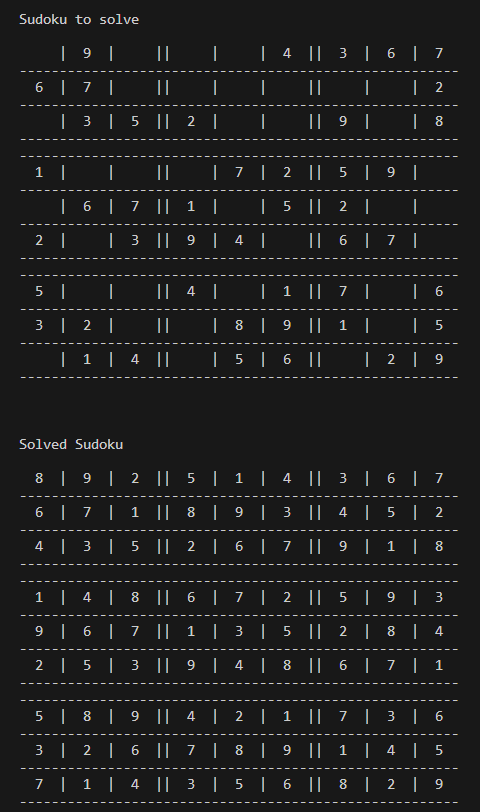

# Sudoku Solver

This C program generates and solves Sudoku puzzles of varying difficulty levels. Sudoku is a puzzle game where the objective is to fill a 9x9 grid with digits (typically 1-9) so that each row, each column, and each of the nine 3x3 subgrids (called "boxes") contains all digits from 1 to 9 without repetition.

## Functionality Overview:
1. **Grid Generation**: The program generates a fully filled 9x9 Sudoku grid adhering to Sudoku rules, utilizing backtracking and a `isSafe()` function to ensure validity.
2. **Difficulty Setting**: The `setDifficulty()` function converts the fully filled grid into a puzzle by randomly removing values within specified upper and lower limits.
3. **Puzzle Solving**: The `solve()` function, employing backtracking, solves the generated puzzle. Upon successful completion, the `transfer_solution_to_box()` function transfers solved grid values into a designated grid with character values.
4. **Display**: Both unsolved and solved Sudoku grids are displayed, allowing users to play puzzles of varying difficulty levels. The program ensures each puzzle has a unique solution.

## Ouput example on easy difficulty:

